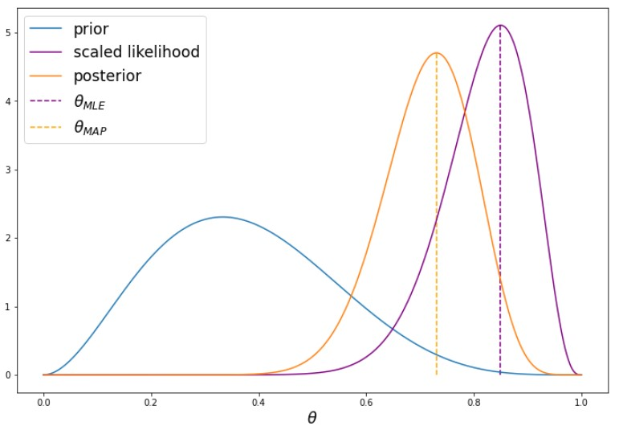
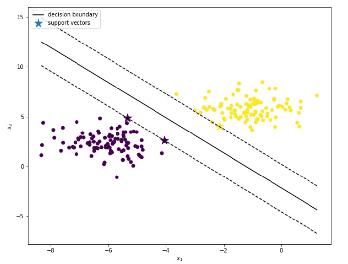

# Machine Learning Algorithms
This repository contains some traditional algorithms in the field of machine learning, e.g. K-NN, SVM, ResNet etc.

## K-Nearest Neighbors classification
In this notebook code to perform k-NN classification is provided. The [iris data set](https://en.wikipedia.org/wiki/Iris_flower_data_set) would be used and some basic functions are implemented to get the classified label(prediction). After that we can compute accuracy of the model. 

## Probabilistic Inference
This notebook contains code implementing the methods about Probabilistic Inference. When dealing with probabilities, we often encounter extremely small numbers. Because of limited floating point precision, directly manipulating such small numbers can lead to serious numerical issues, such as overflows and underflows. Therefore, we usually work in the log-space. 

For example, if we want to multiply two tiny numbers 𝑎 and 𝑏, we should compute `exp(log(𝑎)+log(𝑏))`  instead of naively multiplying `𝑎⋅𝑏` . For this reason, we usually compute log-probabilities instead of probabilities. 

Finally, we compute Maximum likelihood estimate of theta and Maximum a posteriori estimate of theta (see following screenshot).

## Linear Regression
This notebook provides a code skeleton for performing linear regression. In this assignment we will work with the [Boston Housing Dataset](http://lib.stat.cmu.edu/datasets/boston). The data consists of 506 samples. Each sample represents a district in the city of Boston and has 13 features, such as crime rate or taxation level. The regression target is the median house price in the given district (in $1000's).

## Optimization - Logistic Regression
In this notebook code skeleton for performing logistic regression with gradient descent is given. In this assignment we will work with the [UCI ML Breast Cancer Wisconsin (Diagnostic) dataset](https://goo.gl/U2Uwz2).
Features are computed from a digitized image of a fine needle aspirate (FNA) of a breast mass. They describe characteristics of the cell nuclei present in the image. There are 212 malignant examples and 357 benign examples.

## Deep Learning: Feed-Forward Neural Network
This notebook provides a simple example for Feed-forward neural network. We implement Affine layer, ReLu layer, CategoricalCrossEntropy layer,  construct and train a feed forward NN.

## ResNet
In this notebook, we start by re-implementing some common features of deep neural networks (dropout and batch normalization) and then implement a very popular modern architecture for image classification (ResNet) and improve its training loop.

ResNet is the models that first introduced residual connections (a form of skip connections). It is a rather simple, but successful and very popular architecture. In this part of the exercise we will re-implement it step by step.

## Support Vector Machine
n this sheet we will implement a simple binary SVM classifier. Remember, that the SVM dual problem can be formulated as a Quadratic programming (QP) problem. We will solve it using a QP solver from the `CVXOPT` library.

## Dimensionality Reduction
This notebook provides some simple examples of `PCA` and `SVD`.

## Matrix Factorization
The goal of this task is to recommend restaurants to users based on the rating data in the Yelp dataset. For this, we try to predict the rating a user will give to a restaurant they have not yet rated based on a latent factor model. The task it to solve the matrix factorization via alternating least squares and stochastic gradient descent (non-batched, you may omit the bias).

## K-Means and Gaussian Mixture Models & EM
This notebook implements K-Means and Gaussian Mixture Models & EM algorithms.